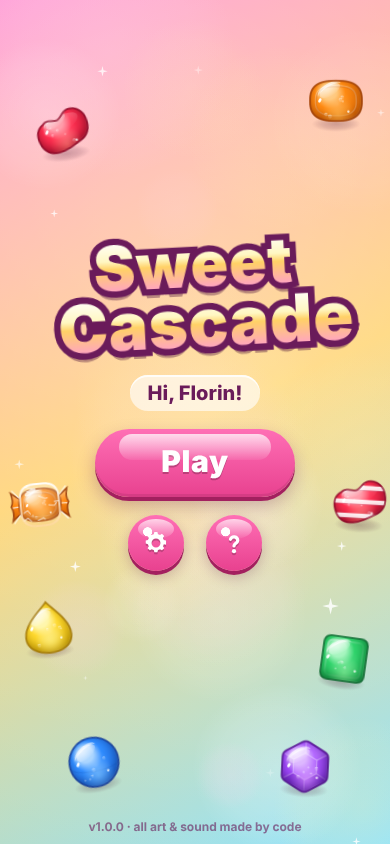
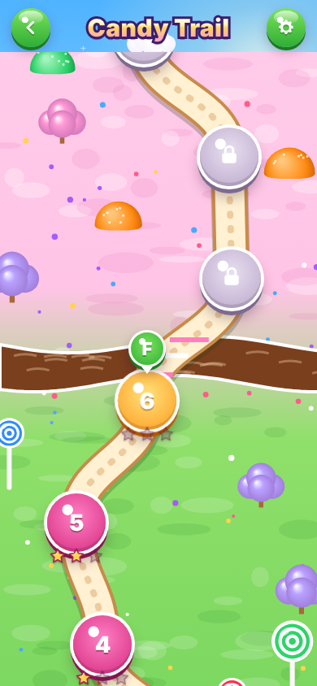
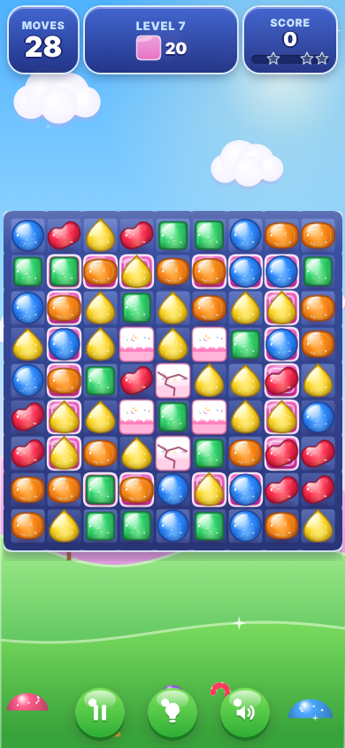
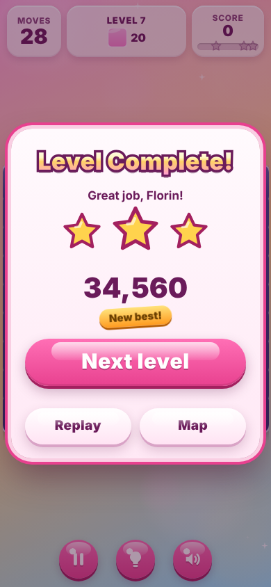
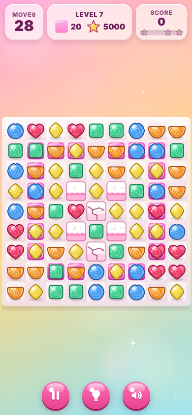
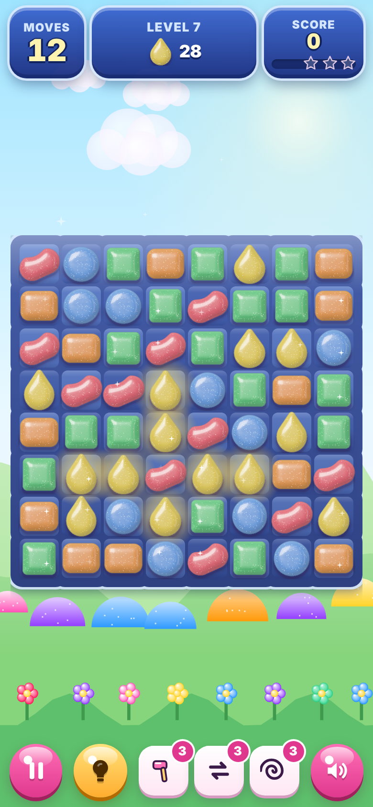
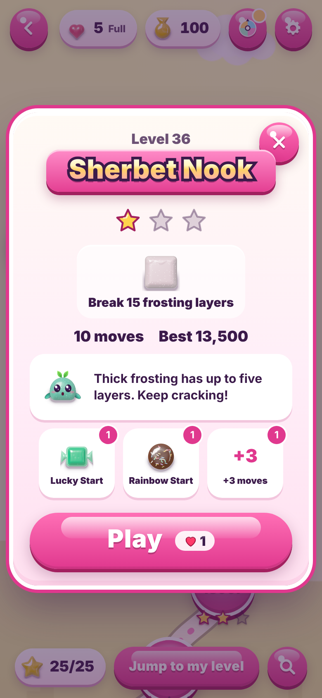

# Sweet Cascade

An original, fully offline **match-3 puzzle game for Android**. Swap candies, match three or more, set off striped,
wrapped and Rainbow Drop specials, clear jelly, crack frosting, free caged candies, stop Cocoa Creep, defuse Fuse
Candies, ride Sugar Belts and portals, and bring cherries and hazelnuts down to the trays, on a winding candy-world map
built for 20,000 levels. Pip, a little gumdrop buddy, shows the way.

GitHub Actions builds, tests, signs and publishes the installable APK. There is nothing to build on your phone or computer.

* **Download:** [latest APK](https://github.com/modderzdark-blip/HoursTracker/releases/tag/latest) (rolling build of the newest commit that passed every test, emulator included) or the versioned release `v1.0.0` under [Releases](https://github.com/modderzdark-blip/HoursTracker/releases).
* **Early preview:** [SweetCascade-v1.0.0-preview.apk](https://github.com/modderzdark-blip/HoursTracker/releases/download/qa/SweetCascade-v1.0.0-preview.apk) is replaced on every push as soon as the APK is built and verified, before the slower emulator tests finish.
* **All art and audio generated procedurally; no third-party assets.** Every candy is shaded per pixel by the game's own code, every sound is synthesized with the Web Audio API, and the app ships no image, font or audio files.
* No ads, no real-money purchases, no analytics, no network access. The app requests no dangerous permissions and has no `INTERNET` permission at all.

<p>
  
  
  
  
</p>
<p>
  
  
  
  
</p>

## Install on your Android phone

1. On your phone, open the [Releases page](https://github.com/modderzdark-blip/HoursTracker/releases) and tap the `SweetCascade-v1.0.0….apk` file. Your browser downloads it.
2. Open the downloaded file (from the browser's download bar or the **Files / My Files** app → *Downloads*). If Android asks, allow **Install unknown apps** for that app.
3. Tap **Install**. If Play Protect shows a warning, choose **More details → Install anyway**. It is your own sideloaded app.

Newer builds install over older ones and keep your progress, because every build is signed with the same key (see *Signing*).
The repository is public, so you don't need to sign in to download.

## What's in the game

* **Candies:** Strawberry Heart, Orange Wedge, Lemon Drop, Mint Cube, Blueberry Orb and Grape Star, each with its own
  color and silhouette. Specials: striped (match 4, row or column), wrapped (L, T or + shape, explodes twice) and the
  Rainbow Drop (match 5). All special + special combos work.
* **Graphics:** a per-pixel candy shader (`www/js/sprites.js`): signed distance field → pillow height → normals,
  wrap diffuse, two specular lobes, a studio-window reflection with Fresnel, subsurface glow, theme detail and a contact
  shadow. Three materials (Settings → Theme): **Gummy** (default), **Hard Candy** and **Sugar Sprinkle**. Sprites are
  shaded lazily into a cache sized to the board, so the first special of a level never stalls an animation.
* **Map:** a winding path in episodes of 15 levels with title cards, 12 scenery families that repeat with palette
  shifts, a marker that hops to the next level after a win (and then opens its intro by itself), **Jump to my level**
  and a **Go to level** box. Only the nodes near the screen exist (at most about 60), so the map is as light at level
  19,000 as at level 1.
* **Mechanics (Tier 1):** jelly (1–2 layers), frosting (1–5 layers), Sugar Cage, Cocoa Creep, Fuse Candy, portals,
  Sugar Belts, cherries and hazelnuts with exit trays.
* **Modes:** score, jelly, ingredients, Candy Order (colors, specials, blockers), timed (each special adds 2 seconds)
  and mixed goals, with a goal tracker that pops when a goal completes.
* **Hints:** the suggested move glows and its candy nudges toward its spot. Settings → Auto hint: **Instant** (default),
  3 s, 8 s or Off; the bulb button shows it any time. Hints prefer the move that wins, then goal progress, then specials.
* **Meta game:** Hearts (5, one refills every 30 minutes; Settings → Unlimited hearts turns them off), Gold Drops
  earned by winning, the boosters Sweet Hammer, Free Swap and Candy Whirl in a level, Lucky Start, Rainbow Start and
  Head Start before a level, **+5 Moves** (or +15 seconds) when you run out, the Daily Wheel, the Sweet Streak (a reward
  every 3 wins in a row) and the Star Chest (every 25 stars). Everything is earned in play; nothing is sold.
* **Sweet Finale:** moves left at the end turn into striped candies that fire for bonus points.
* **Juice:** squash and stretch, gravity falls, pops with particles, beams and shockwaves, cascade banners
  ("Tasty!" … "Sugar Storm!"), confetti, Pip's reactions and haptics. Animation speed: Normal, Snappy (default) or Fast.
* **Personal touches:** your name on the title and win screen, a background photo picked with the system photo picker
  (it stays on the phone), accent palettes and a custom level-complete message.
* **Accessibility:** color-blind assist (a symbol on every candy), reduced motion (also follows the system setting),
  labelled buttons, visible focus rings, a screen-reader live region, and keyboard play on desktop.
* **Settings → Run self-test** runs the logic test suite and a 200-game bot simulation on the phone and shows a green or
  red report you can copy.

### Gentle, ear-safe audio

All sounds are soft sine and triangle tones that pass through a low-pass filter, a high-shelf cut, a compressor and a
fixed −6 dB trim before the master volume, so nothing is sharp or loud even at full volume. Music plays about two loops,
fades out, rests in silence and comes back later; it never loops endlessly. On first launch the game asks
"Is this volume comfortable?". **Settings → Sound Check** plays a short sample of the main sounds one after another: use
it to set Overall, Effects and Music volume, and turn on **Soft Sounds** for an extra-gentle mix.

## How it is built

| Part | Where |
|---|---|
| Game (vanilla JS ES2020, Canvas 2D board, DOM/CSS UI) | `www/` |
| Level packs (100 levels per file) and their manifest | `www/levels/` |
| Capacitor 8 Android project | `android/` |
| Tests (Node, audio, Playwright, APK verification, emulator) | `tests/` |
| Level generator and calibration, icon and sprite-sheet tools, CI helpers | `scripts/` |
| Difficulty report (CSV and chart) | `docs/difficulty/` |
| CI workflows | `.github/workflows/android.yml`, `.github/workflows/levels.yml` |

Game code is plain script files loaded in order, each one labelled section on `window.SC`:
`config.js`, `util.js`, `logic.js` (LOGIC: pure and DOM-free), `levels/manifest.js` + `levels.js` (LEVELS: lazy packs),
`audio.js`, `sprites.js` (the shader), `scenery.js`, `pip.js`, `render.js`, `storage.js`, `meta.js` (hearts, gold,
boosters, wheel, streak, chest), `selftest.js`, `ui.js`, `map.js`, `input.js`, `game.js` (state machine: TITLE → MAP →
INTRO → PLAYING → RESOLVING → WON/LOST, plus PAUSED) and `boot.js`.

**Architecture rule:** `LOGIC.applySwap(state, from, to)` computes the full result of a move instantly and
deterministically and returns the new state plus an event list (swap, match, clear, create, fall, spawn, collect, jelly,
frosting, cage, cocoa, portal, belt, fuse, score, shuffle, …). The renderer only animates that list. Replaying the events
on the starting board reproduces the final board exactly; this is tested on random moves.

### CI pipeline (`.github/workflows/android.yml`)

Every push, every `v*` tag and manual runs execute:

1. **logic**: 52 Node tests (`node tests/logic.test.js`), then fuzz games and greedy-bot games on every shipped level (`node tests/simulate.js`).
2. **levels**: `node tests/levels.test.js`: shipped levels are valid and solvable, one new idea per level, complexity budget, the calibrated difficulty curve, and a scale test that generates levels 61–360 plus a sample up to 20,000.
   **levels-pipeline**: runs `levels.yml` end to end on levels 61–100 with a small bot budget (nothing is published).
3. **audio**: `node tests/audio/run-audio-tests.mjs` renders every sound, a 6-sound + music stress mix and both music tracks offline in Chromium at maximum settings and checks peak level, clicks at the edges, sample jumps, energy above 4 and 6 kHz, spectral centroid, length, envelope and the loop seam.
4. **browser**: Playwright with Chromium mobile emulation (`npx playwright test`). It plays Level 1 to a win with real swipes and taps, and checks persistence, losing, +5 Moves, hearts, boosters, the timed clock, pause/restart/quit mid-animation, Back, lifecycle, hints, settings, the self-test and reduced motion. It also captures screenshots of every screen at 360×640, 390×844, 412×915, 430×932, 673×841 and 768×1024 in all three themes (including the map at levels 1, 40, 5,000 and 19,000), plus landscape, desktop and the zoomed art sheets.
5. **build**: Node 22, JDK 21, Android SDK, `npx cap sync android`, then Gradle `assembleDebug assembleRelease bundleRelease`.
6. **apk-verify**: `aapt2 dump badging`, `apksigner verify` and a scan of the bundled assets (`tests/apk/verify-apk.mjs`). Right after it, the verified APK is attached to the `qa` pre-release as `SweetCascade-vX.Y.Z-preview.apk`.
7. **emulator**: Android 14 (API 34) emulator, Pixel 6 profile (`tests/emulator/run-emulator-tests.sh`). It installs the APK, wins Level 1 with real `adb` swipes, and tests Back at every screen, Home and resume, the portrait lock, the photo picker, the on-device self-test, airplane mode, 3 minutes of play (frame pacing and memory), the map at a seeded level-19,000 save, release cold start and a 3,000-event monkey run.
8. **release**: replaces the rolling `latest` pre-release with the new APK. A `v*` tag (or a manual run with *publish versioned release* ticked) creates the versioned release.

Screenshots, logs and reports are uploaded as workflow artifacts and also attached to the `qa` pre-release, so they can be
downloaded without signing in. That pre-release is not a game build.

`versionName` comes from `package.json`; `versionCode` is the CI run number, so every build upgrades the previous one.

### Signing

Android only installs an update over an existing app when both are signed with the same key.

* **If these repository secrets exist**, release builds are signed with your own stable key: `ANDROID_KEYSTORE_B64`, `ANDROID_KEYSTORE_PASSWORD`, `ANDROID_KEY_ALIAS`, `ANDROID_KEY_PASSWORD`. The file is named `SweetCascade-vX.Y.Z.apk`.
* **Until then (the current state)**, the optimized, non-debuggable release build is signed with the project's public *sideload key* (`android/sideload-debug.keystore`, the standard Android debug-key convention). The file is named `SweetCascade-vX.Y.Z-debug.apk`. This key is not a secret; it exists so every CI build installs over the last one without losing progress. The trade-off is that anyone could sign an "update" with it, so only install APKs from this repository's Releases page.

To switch to your own private key (optional): create a keystore once on any computer, for example
`keytool -genkeypair -keystore sweetcascade.jks -alias sweetcascade -keyalg RSA -keysize 2048 -validity 10000`,
then add the four secrets under **Settings → Secrets and variables → Actions** (`ANDROID_KEYSTORE_B64` is the output of
`base64 -w0 sweetcascade.jks`). Switching keys means uninstalling the sideload-signed app once (Android refuses an update
signed with a different key), which resets local progress.

### Decisions recorded

* **System fonts only:** the spec's rounded stack starts with "Baloo 2", "Nunito" and "Quicksand", but the game names only system fonts (`ui-rounded, system-ui, -apple-system, Roboto, "Segoe UI", sans-serif`) and bundles no font files, because on Android a named font that is not installed makes the WebView ask Google Play services' font provider, which ties the game's process to Play services (`apk-verify` checks this). On Android it uses the phone's own sans-serif in heavy weights.
* **JDK 21 instead of 17:** Capacitor 8's Android library is compiled for Java 21, so CI uses Temurin 21.
* **Native shell plugin:** keep-awake, the system photo picker (`PickVisualMedia`, no storage permission), display-cutout insets and app info come from one small app plugin (`NativeShellPlugin.java`) instead of extra third-party dependencies. Immersive fullscreen is applied natively in `MainActivity`; Capacitor 8's core `SystemBars` replaces the status-bar plugin.
* **Save format v4:** per-level stars as 2-bit values plus best scores (stored as score/10 in varints), base64-encoded. A save with 20,000 cleared levels is about 58 KB and parses in a few milliseconds. Older saves migrate automatically.
* **Star thresholds:** 1 star is the goal itself. 2 and 3 stars start from 1.6× and 2.4× of it but are capped by the bot calibration (3 stars at most the 20th-percentile greedy-bot winning score and the 10th-percentile random-bot score), so an ordinary win usually earns 3 stars.
* **Packs:** v1.0 ships levels 1–60 (25 hand-authored, the rest generated and calibrated) in `www/levels/pack-0001.js`. `getLevel(n)` accepts 1–99,999; after the last shipped level the map shows "More levels coming soon!".
* **Cocoa cap and no-move loss:** Cocoa Creep never covers more than half the board; if a board ever has no possible move even after a reshuffle, the level ends with "No more moves!" instead of soft-locking.
* **Timed levels:** the clock pauses during every popup and while the app is in the background; each special candy created adds 2 seconds.
* **Retries:** each attempt uses a fresh deterministic seed derived from the level seed, so retries show new boards.
* **Branch:** development happened on the session branch, and CI runs there, so `latest` and `v1.0.0` were published from it.

## Adding levels

### With `levels.yml` (recommended, no computer needed)

Open **Actions → Levels - generate and calibrate → Run workflow** and fill in:

| Input | Meaning |
|---|---|
| `from` | first level to add; must be exactly one past the last shipped level (61 today) |
| `to` | last level to add |
| `games` / `random_games` | greedy-bot and random-bot games per calibration step (300 / 100 by default) |
| `shard_size` | levels per parallel calibration job |
| `open_pr` | also open a pull request (otherwise only a branch is pushed) |

The workflow generates the levels with `scripts/levels/generator.js`, calibrates moves or time with bots in parallel
shards (binary search to the target win rate of each level's role), merges them into the packs, updates the manifest
and the difficulty report in `docs/difficulty/`, runs the level tests, and pushes `levels/<from>-<to>-run<N>`. Merge it
and the next CI build ships the new levels.

Locally the same thing is `node scripts/calibrate.js --from 61 --to 100 --games 300` (usage at the top of the file).

### By hand

Hand-authored levels live in `scripts/levels/authored.js` (levels 1–25). A level record:

```js
{
  id: 21, name: 'Portal Parlor', role: 'normal', moves: 24, colors: 5, seed: 21021, rows: 9, cols: 9,
  layout: ['.........', /* one string per row, see the legend below */],
  meta: { portals: [{ in: [3, 0], out: [5, 2] }], fuse: 16 },   // portal pairs [row, col]; Fuse Candy countdown
  goals: [{ type: 'collect', color: 2, count: 30 }],             // score | collect | jelly | ingredients | order
  newMechanic: 'portals',
  tutorial: 'Optional one-line intro.', tip: 'Optional tip from Pip.',
}
```

`scripts/calibrate.js` then tunes only its `moves` (or `time`) and sets its star thresholds; the layout stays as written.

Layout legend (`LOGIC.LAYOUT_LEGEND`): `.` normal, `#` hole, `j`/`J` single/double jelly, `1`–`5` frosting layers,
`k` Sugar Cage, `o` Cocoa Creep, `b` Fuse Candy (countdown in `meta.fuse`), `c` cherry, `h` hazelnut, `x` exit tray,
`p`/`P` portal entrance/exit (pairs in `meta.portals`), `>` `<` `^` `v` Sugar Belt direction.

Mechanics unlock gradually (one new idea per level): collect 2, jelly 5, ingredients 9, Candy Order 12, frosting 13,
double jelly 15, timed 17, Sugar Cage 19, portals 21, Cocoa Creep 22, Fuse Candy 24, mixed goals 25, Sugar Belt 31,
thick frosting 36, hazelnut 41.

## Adding a Tier 2 mechanic

Every blocker and board feature is a plugin object in `www/js/logic.js` (see the interface comment above `JELLY`).
To add, for example, **Jam Jar**:

1. Write `const JAM_JAR = { id: 'jam', symbols: { m: 'Jam Jar' }, … }` with the hooks it needs: `parseCell` to read
   its layout character, `afterFill` to seal the candy, `blocksSwap` / `blocksFall` while sealed, `absorbHit` to take a
   layer off per clear (`damageBlocker` emits the event and scores it), `goalProgress` if it owns a goal type, and
   `orderCounter` to feed Candy Orders.
2. Add it to `MECHANICS` (and to `MOVE_END_ORDER` if it acts after every move with `onMoveEnd`).
3. Draw it in `www/js/render.js` (a sprite recipe in `sprites.js` plus a playback case for its event) and give it an
   intro text in `scripts/levels/generator.js`.
4. Add its unlock level to `UNLOCKS` in the generator and tests in `www/js/selftest.js` (they run in Node, the browser
   and on the phone).

Planned Tier 2 mechanics: Jam Jar, Taffy Swirl, Gift Box, Magic Mixer and Lucky Candy, each to be introduced in the
generated levels after level 60 (one new idea per level, following the same unlock rules).

## Running the tests yourself (optional)

```bash
npm ci
npx playwright install chromium            # once, for the audio and browser tests
node tests/logic.test.js                   # logic test suite
node tests/levels.test.js                  # level validity, difficulty curve, 20,000-level scale test
node tests/simulate.js                     # fuzz + bot simulation per shipped level
node tests/audio/run-audio-tests.mjs       # ear-safety checks, writes audio-report/
npx playwright test                        # browser QA + screenshots in qa/
node scripts/generate-icons.mjs            # regenerate launcher, monochrome, store and splash icons
node scripts/sprite-sheet.mjs              # PNG contact sheet of every candy sprite
```

## Credits

Game design, code, art and sound were made for this project. All art and audio generated procedurally; no third-party
assets. Built with [Capacitor](https://capacitorjs.com/) (MIT).
